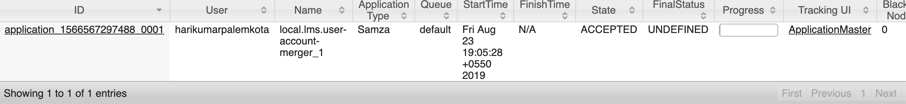

## Install kafka and Hadoop in local machine :
Always start the nodemanager and resourcemanager after the leaner application, because internally learner application and hadoop run on same port "8088"


### Starting yarn:
under hadoop

sbin/yarn-daemon.sh start nodemanager

sbin/yarn-daemon.sh start resourcemanager


### run zoo-keeper:
bin/zookeeper-server-start.sh config/zookeeper.properties


### run kafka-server:
bin/kafka-server-start.sh config/server.properties


### create topic:

bin/kafka-topics.sh --create --zookeeper localhost:2181 --topic dev.lms.notification  --replication-factor 1 --partitions 1

### create consumer:

bin/kafka-console-consumer.sh --bootstrap-server localhost:9092 --topic dev.lms.notification --from-beginning

### Configurations changes for creating and running Samza job :

* samza job contains config folder which inturn have properties which contains the samza configurations.
* configure the task.class with your customized class, this will be the entry point of samza
* configure the kafka topic as below
* configure the job name as below 
    * task.class=org.sunbird.jobs.samza.task.NotificationJob
    * task.inputs=kafka.__env__.lms.notification
    * job.name=__env__.lms.notification
    * max.iteration.count.samza.job=2
    * kafka.retry.topic=__env__.lms.notification

    
* configure application related properties in this file.
* It contains src.xml which helps creating a tar of the application
* The path of the  application properties is configured, such that it creates this file while creating tar of the application


```
<file>

    <source>${basedir}/src/main/config/notification-job.properties</source>

    <outputDirectory>config</outputDirectory>

    <filtered>true</filtered>

</file>
```

* Add project as line item in the include tag, finally tar is created with all samza, kafka and project related dependencies.
    * <include>org.sunbird.lms.jobs.samza:notification-job</include>

    
* In the distribution sub-module, add the new created job sub-module as a dependency


* Every time we do modification to the job , please update dependency version on the job and updated version is modified in the distribution sub-module pom.
* Run "mvn clean install" on the samza job sub-module
* Run mkdir -p deploy/samza
* untar the tar and copy to deploy/samza path
    * tar -xvf target/notification-job-0.0.1-distribution.tar.gz -C deploy/samza/

    
* Run the job with command
    * deploy/samza/bin/run-job.sh --config-factory=org.apache.samza.config.factories.PropertiesConfigFactory --config-path=[file:/Users/harikumarpalemkota/Documents/hari/hari-repo/sunbird-lms-jobs/samza/notification-job/deploy/samza/config/local.notification-job.properties](http://file/Users/harikumarpalemkota/Documents/hari/hari-repo/sunbird-lms-jobs/samza/user-cert-merge/deploy/samza/config/local.user-account-merger.properties)

    
* Once the samza job is deployed trigger the hadoop cluster url: "[http://localhost:8088/cluster/](http://localhost:8088/cluster/)' and you can find line item as below


```

```


```

```
Once the samza job created, run maven command "M


*****

[[category.storage-team]] 
[[category.confluence]] 
