This document describes the steps of how to configure brute force login attacks management in keycloak, and how to create user accounts in keycloak with manage-users permission so that they unlock the locked users (because of a brute force attack on their account).

## Configure Brute Force Detection

* Open keycloak home by opening the url  **_{{host_name}}/auth_** , e.g.: [https://dev.sunbirded.org/auth/](https://dev.sunbirded.org/auth/)

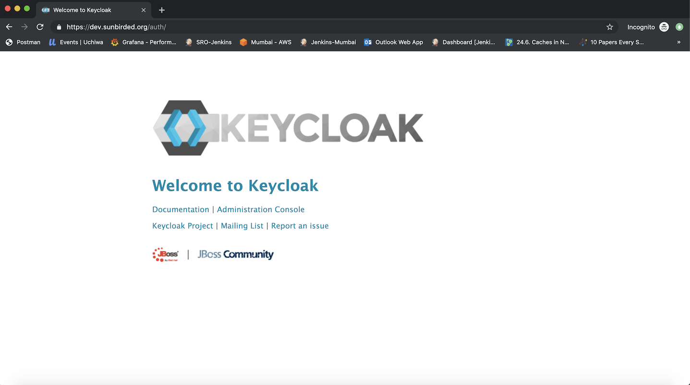

* Click on "Administration Console" and login with "admin" user credentials

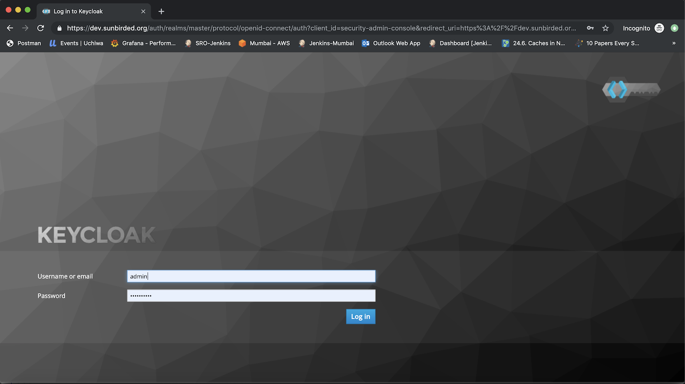

* Click on "Realm Settings" in the left pane to open the "Sunbird" realm settings page

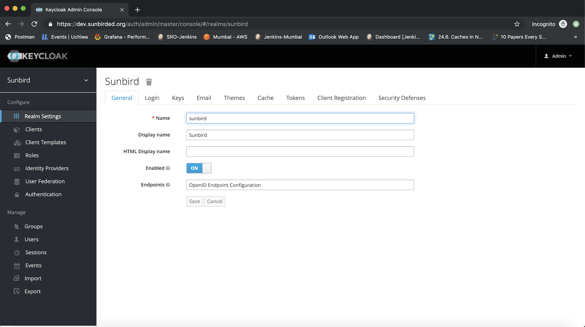

* Click on "Security Defenses" tab

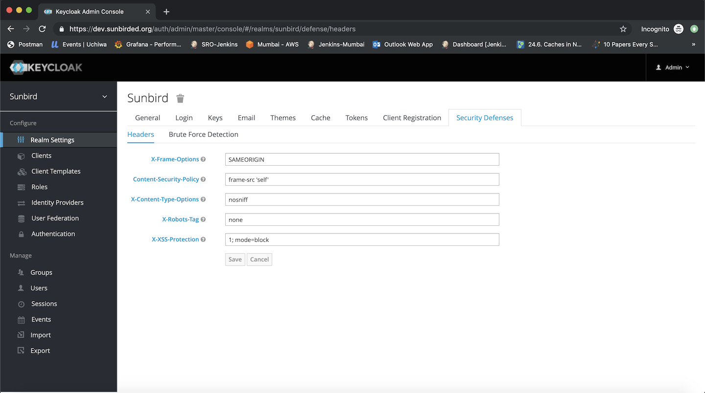

* Click on "Brute Force Detection" tab to configure the brute force detection:
    * Set the  **Enabled**  flag to  **ON** 
    * Set  **Permanent Lockout**  flag to  **OFF** 
    * Set  **Max Login Failures**  to  **10** , to allow 10 unsuccessful attempts before the account gets locked
    * Set  **Wait Increment**  to  **24 Hours** , this will automatically unlock the user after 24 hours
    * Click on  **Save**  to save the settings

    

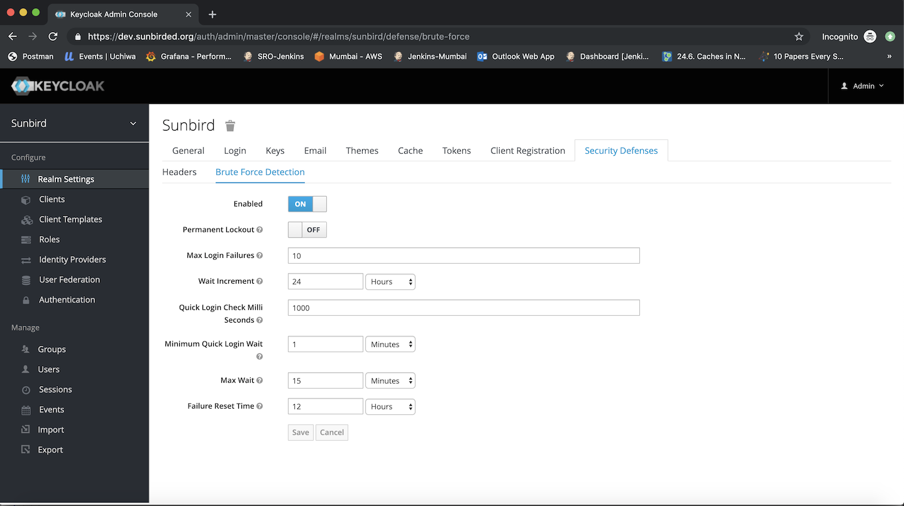

More details about brute force configuration are available at [https://www.keycloak.org/docs/2.5/server_admin/topics/threat/brute-force.html](https://www.keycloak.org/docs/2.5/server_admin/topics/threat/brute-force.html).
## Create User account with manage-users permission

* Switch to  **Master**  realm by changing the realm in the left pane

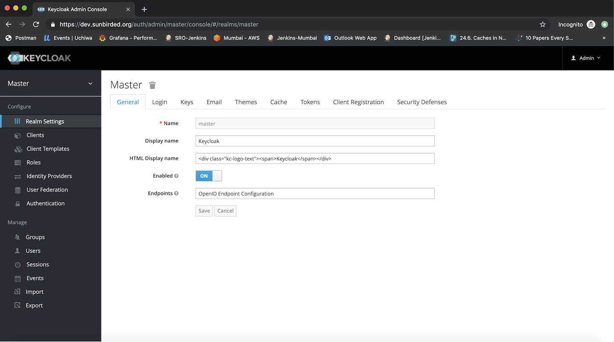

* Click on  **Users**  in the left pane and click on  **Add user**  button in  **Users**  page to create a new user

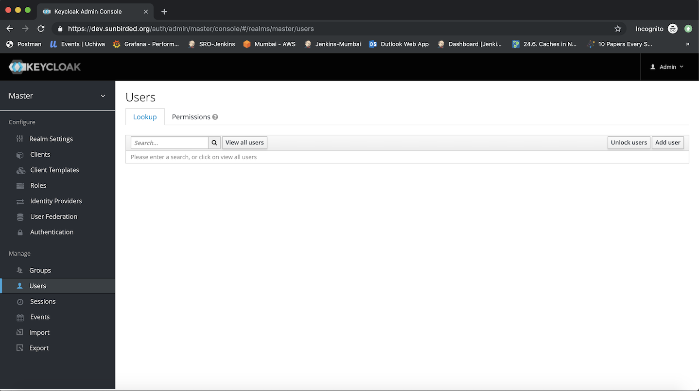

* Provide a user name for the user (e.g. support_user) and click on  **Save**  button

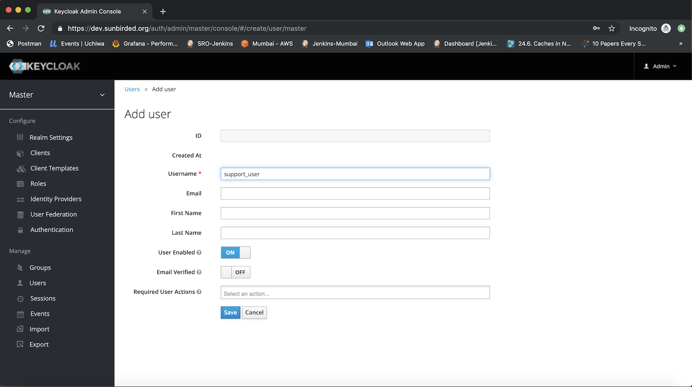

* User is created and the user details page is displayed

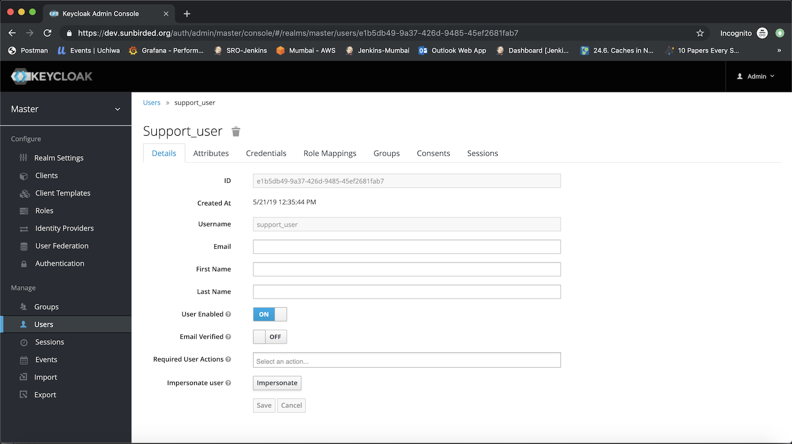

* Click on  **Role Mappings**  tab

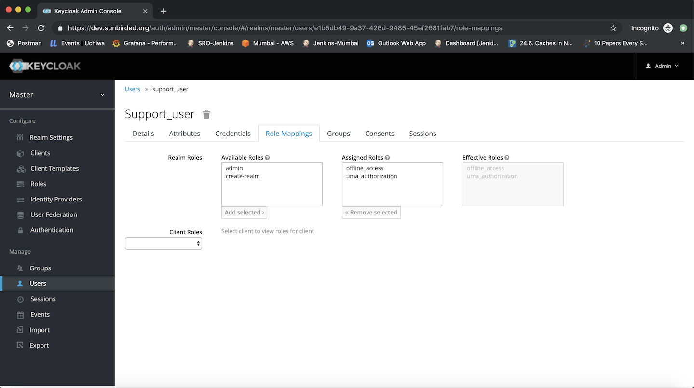

* Select  **sunbird-realm**  in the  **Client Roles**  drop down

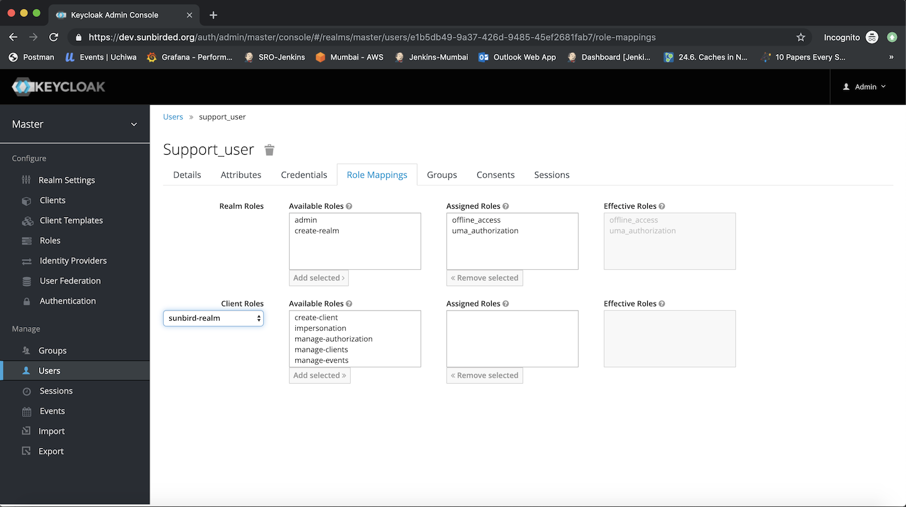

* Select  **manage-users**  role from  **Available Roles**  list and click on  **Add selected >>**  button

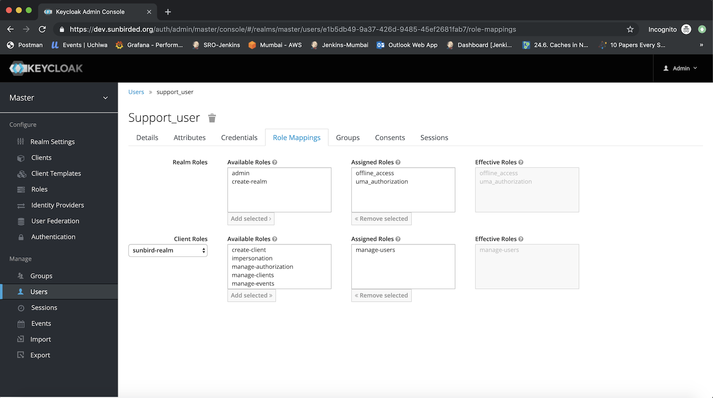

* Click on  **Credentials**  tab

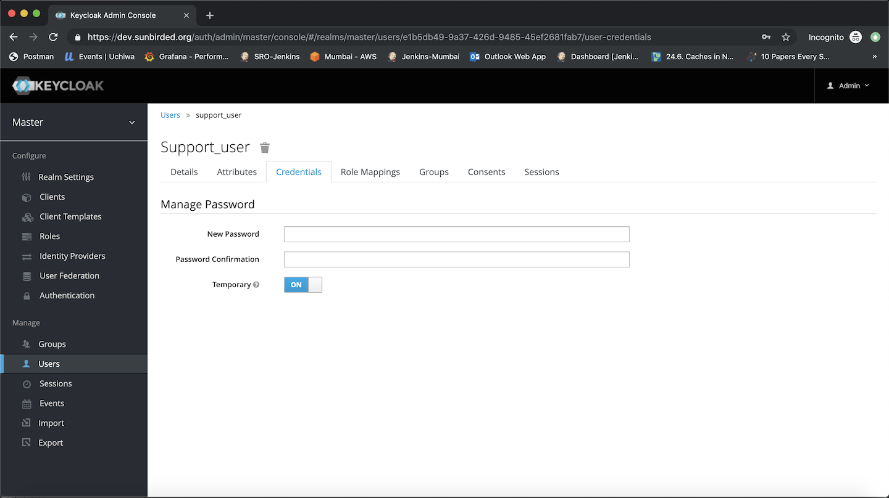

* Set a password for the newly created user by providing  **New Password**  &  **Password Confirmation**  values, set the  **Temporary**  flag to  **OFF**  and click on  **Reset Password** 

* Click Change Password in the confirmation popup to confirm the password change

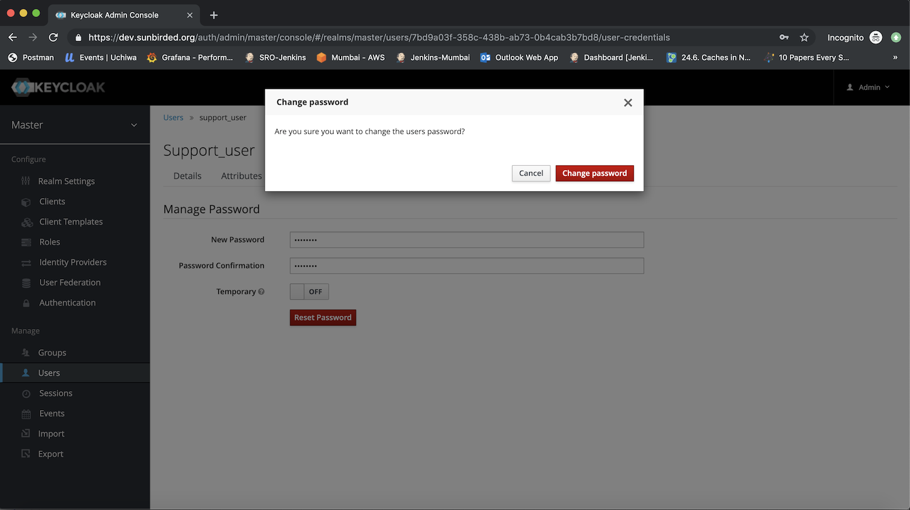

The newly created user can login to the Keycloak administration console with the username and password set in the creation steps. Note that this user have " **manage-users** " permissions and can perform operations like delete user, change password, etc. This user does not have permission to impersonate other users.
## Unlock a locked user

* Login to Keycloak administration console with the credentials of the newly created user (using the steps above)

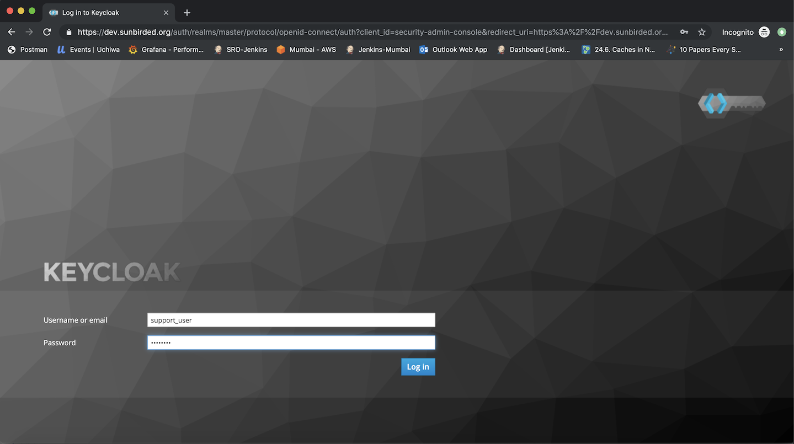

* Go to the users list page by clicking on  **Users**  in the left pane

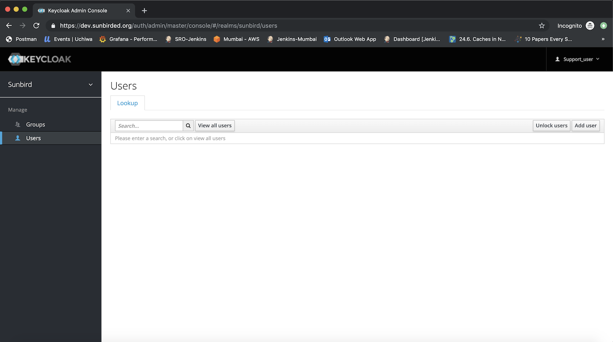

* Search for locked out user by typing the username in the search box and press Enter

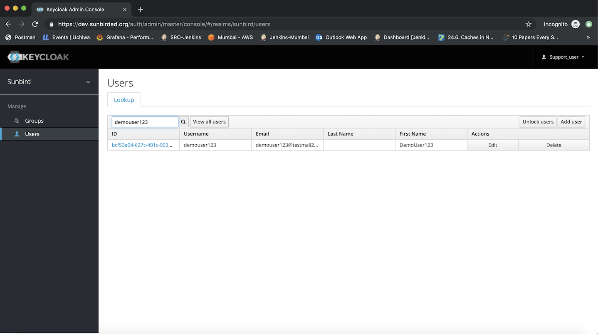

* Click in the user  **ID**  to go to the user details page. If the user is locked out,  **User Enabled**  flag will be set to  **OFF** 

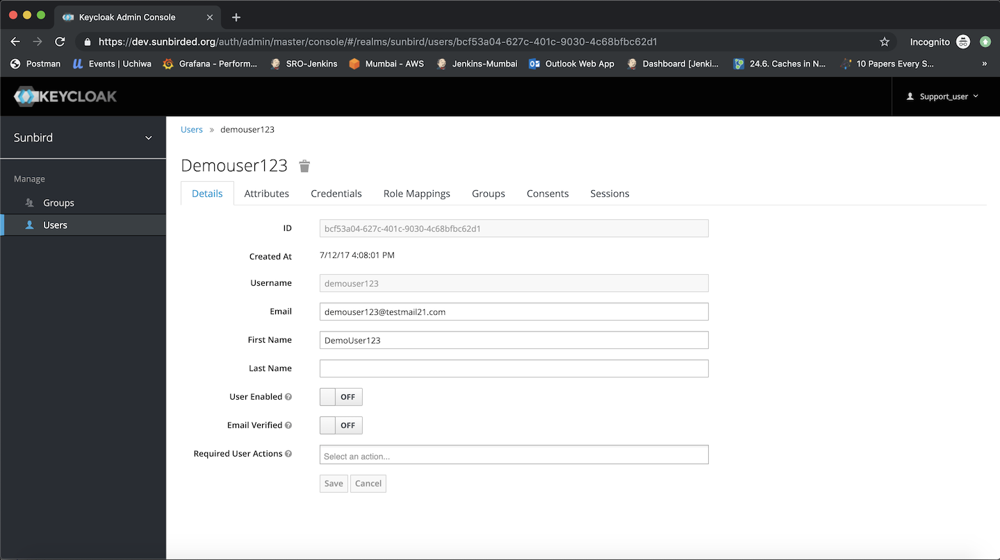

* Change the  **User Enabled**  flag to  **ON**  and click on  **Save** . Locked out user will be able to login now.

## Configuring the message for account lockout
The message to be displayed when a user account gets locked can be configured by updating the messages_en.properties file in sunbird-devops repository (or in the forked repository that is used to build and deploy keycloak in a sunbird instance).

* Open the file  **sunbird-devops/ansible/artifacts/sunbird/login/messages/messages_en.properties** 
* Update value for the key accountTemporarilyDisabledMessage
    * Ex: accountTemporarilyDisabledMessage=Your account has been locked due to too many incorrect login attempts. You can re-attempt to login after 24 hours. Please get in touch with the help desk team for support

    

 **accountTemporarilyDisabledMessage**  is displayed only in cases of a login attempt with valid credentials for a user account that is locked.

true

|  | 
|  --- | 
|  | 

*****

[[category.storage-team]] 
[[category.confluence]] 
